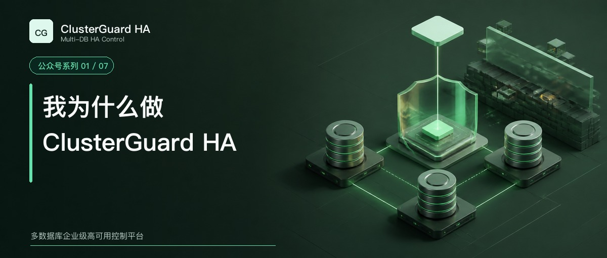

# 我为什么做 ClusterGuard HA

这个项目最早没有一个宏大的多数据库平台计划。

当时要解决的事情很具体。三台 MySQL 服务器需要自动安装，主从关系要能建立，主库故障后 VIP 要跟着新主移动。机器重新启动以后，VIP 应该自动回到当前可写主库。旧主恢复时，最好在页面上点一下，就能判断它适合增量回挂，还是需要重新同步数据。

这些需求单独看都不新鲜。MySQL 有复制，Linux 有地址管理脚本，监控系统能探测端口，开源工具也能发现拓扑和提升从库。困难出现在它们连成一套生产流程以后。一次切换可能改了数据库角色，却没有改业务入口。旧主恢复后仍然可写，页面还沿用上一次发现的数据。主机名变化以后，同一台数据库在清单里多出一份记录。命令已经返回成功，后置验证却没有完成。

我想做的产品，必须把这些状态放进同一个控制系统里。

## 原型先证明需求确实存在

第一阶段以 Orchestrator 为基础做了企业增强原型。它很适合验证拓扑发现、候选评估和恢复流程。围绕原型，我们逐步加入了 VIP 联动、安全门禁、审批、操作锁、审计报告、旧主修复和白屏控制台。

这个阶段很有价值。很多纸面上看起来合理的功能，只有放到三台机器上反复切换才会暴露实际问题。

主库进程停止和整台机器失联是两种故障。网络分区又是第三种故障。控制节点还能看到多数派时，可以继续协调。旧主落在少数分区里时，必须证明它已经失去继续持有 VIP 和写入的资格。控制器重启以后，操作锁、租约和执行状态还要保留下来。值班人员连续点击两次，也不能产生两条并发切换流程。

原型让这些需求从想法变成了测试场景，也让产品边界越来越清楚。

## 继续扩展旧内核会越来越难

随着功能增加，问题已经超出页面和 Hook 的范围。

节点身份需要重新设计。`hostname:port` 会变化，不适合做长期资源主键。平台需要给资源分配不可变的 `resource_id`，再用 MySQL `server_uuid` 识别数据库实例。主机名、IP 和端口只作为可修改端点，旧地址进入别名记录。

执行模型也需要统一。计划切换、故障切换、节点扩容、旧主恢复和元数据修正，都要经过发现、预检查、计划、安全门禁、操作锁、授权、执行、验证、审计和报告。适配器只能执行数据库动作，不能绕过平台门禁直接改变生产状态。

控制面还要有自己的高可用。Leader、Raft 多数派、持久操作状态、短期 VIP 租约和 Agent 本地隔离必须一起工作。数据库节点和控制节点可以混合部署，也可以分开部署。离线环境需要一份可校验的安装包，安装前能看只读计划，失败以后能找到明确阶段。

继续在旧项目上叠加这些变化，会让产品身份、接口和运行边界越来越含糊。于是我们冻结了原型，保留需求、页面和故障测试经验，另起一个独立仓库，从资源模型和工作流开始重做。

ClusterGuard HA 由此形成。

## 新内核先把几个原则写死

第一条原则是资源身份不能随地址变化。数据库改主机名、IP 或端口时，平台更新端点，不制造一个新节点。

第二条原则是任何高风险动作都只有一个执行入口。Web 控制台、API 和 `cgctl` 最终进入同一套工作流，Adapter 无权跳过 Safety Guard、操作锁、授权和验证。

第三条原则是主库和业务入口必须保持一致。MySQL 2.1 交付线把主库角色与 VIP 作为一次受控操作处理。后端没有验证唯一可写节点和唯一 VIP 所有者时，页面不会给出完整成功。

第四条原则是发现结果只展示能够证明的事实。探测不到的数据库显示不可达，无法确认的角色显示未知。历史拓扑可以用于审计，不能伪装成当前健康状态。

第五条原则是故障恢复要有后半程。新主上线以后，旧主还要根据 GTID、binlog 和数据分叉情况选择增量回挂或全量重建。完成数据验证、复制恢复和 VIP 归属检查以后，恢复任务才结束。

## MySQL 做稳以后，PostgreSQL 接上来了

ClusterGuard HA 的资源模型和 Adapter SDK 为 PostgreSQL、Oracle 与 SQL Server 留出了边界。产品名称也没有绑定某一种数据库。

不过，架构能注册四种数据库，不等于四种数据库已经完成同等生产认证。MySQL 是最早积累安装、切换、VIP、旧主恢复和破坏性测试场景的一条线，因此 2.1.45 只把 MySQL 列为正式支持范围。

进入 2.2 以后，PostgreSQL 原生流复制适配器完成了发现、身份、拓扑、候选评估、计划切换、自动故障切换、写 VIP 和旧主回挂。PostgreSQL 16.4 三节点环境已经通过连续切换、主库强制断电、网络分区、Raft 失多数、并发操作和 `pg_rewind` 回挂测试。这个结果证明 2.2 的核心流程已经成立，生产使用仍要按客户现场条件重新验收。

Oracle Data Guard Broker 与 SQL Server Always On 需要各自的身份模型、端点机制、切换语义和故障矩阵。未完成的能力会明确返回 `unsupported`，不会做一个看起来能点、后台却没有真实执行的按钮。

这个节奏可能显得保守。高可用产品最怕的恰恰是界面走在证据前面。

## 我希望它最终解决什么

ClusterGuard HA 不打算只提供一条更快的切换命令。它要让运维人员知道当前主库是谁，候选为什么被推荐，VIP 在哪里，切换经过了哪些检查，旧主还能否安全回来。

它也要让管理者在事故以后查到完整证据。谁发起了操作，源节点和目标节点是什么，哪个门禁放行了执行，后置验证发现了什么，报告是否已经落盘，这些信息都应该留在同一条操作记录里。

离线安装、中文控制台、固定节点身份、集群清单、节点生命周期和审计报告，看起来不像数据库高可用算法。对负责交付和夜间值班的人来说，它们决定了一个方案能不能长期使用。

下一篇会回到 MHA。它解决过哪些关键问题，今天仍然适合哪些环境，ClusterGuard HA 又为什么继续往完整控制平台的方向走。

[返回系列目录](wechat-series.md)
