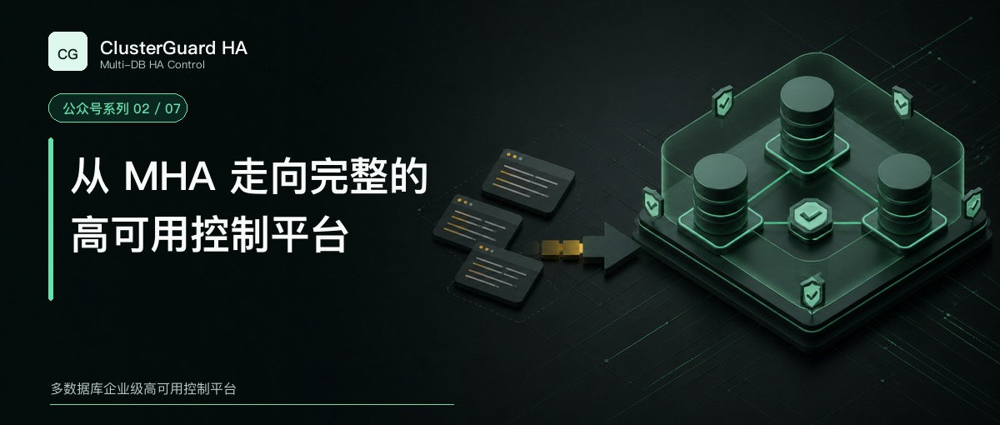

# 从 MHA 走向完整的高可用控制平台

谈 MySQL 高可用，很难绕开 MHA。

在大量 MySQL 主从架构里，MHA 把故障切换从一套临时脚本变成了可以复用的工程方案。它能监控主库，选择候选节点，补齐差异 relay log，提升新主，并让剩余从库重新指向新的复制源。计划维护时，它也提供在线切换能力。

这些工作解决了一个关键问题。主库失效以后，怎样尽量保住已经到达从库、却还没有被完整应用的数据，并缩短恢复时间。

今天设计新的高可用平台，依然应该先理解 MHA 做对了什么。

## MHA 的核心结构很清楚

MHA 由 Manager 和 Node 两部分组成。

Manager 负责监控、候选选择和切换编排。Node 工具安装在数据库服务器上，用于保存 binlog、应用 relay log 差异和执行切换阶段的辅助动作。Manager 通过 SSH 调用这些工具，也可以在独立管理机上运行。

按照 MHA 官方文档，它支持自动故障切换和计划在线切换。官方 Overview 给出的历史典型数据是故障切换约十到三十秒，在线切换期间写入阻塞约零点五到两秒。这些数字描述的是项目文档中的典型情况，具体站点仍会受数据库版本、日志量、网络、脚本和隔离方式影响。

MHA 还把很多现场差异留给扩展脚本处理。VIP 漂移、主库关停、外部隔离和通知都可以接入自定义命令。这样的设计保持了内核专注，也方便有成熟脚本体系的团队按自己的网络和服务发现方案组合。

## MHA 适合什么环境

如果一套 MySQL 复制架构已经很稳定，节点数量不多，运维团队熟悉 SSH、复制命令和故障脚本，MHA 仍然是一种直接而有效的选择。

它尤其适合边界明确的场景。集群关系由 DBA 维护，VIP 或代理已经有独立方案，切换日志能够纳入现有审计，旧主修复也有成熟运行手册。在这种条件下，MHA 的职责清楚，改造成本可控。

所以，ClusterGuard HA 的出发点并不是证明 MHA 失效了。我们面对的是另一组产品要求。

这些要求包括长期维护资源身份，集中管理多套集群，统一控制主库和业务入口，保存操作状态，为并发变更加锁，限制越权执行，完成旧主恢复和节点扩容，并把安装、页面、审计、报告和监控接口一起交付。

## 差异落在控制范围上

MHA 的中心任务是 MySQL 主库切换。ClusterGuard HA 把切换放进更大的资源与操作生命周期里。

| 关注点 | MHA | ClusterGuard HA 2.1 |
| --- | --- | --- |
| 主要目标 | MySQL 主库故障切换与在线切换 | MySQL 高可用控制、端点协调、恢复和交付 |
| 运行结构 | Manager 通过 SSH 调用 Node 工具 | 三个或更多奇数控制节点、Raft、受限 Agent |
| 节点身份 | 以主机和实例配置为主要入口 | 平台 `resource_id` 与 MySQL `server_uuid` |
| 候选选择 | 依据复制位置、配置和候选规则 | 依据清单、健康、GTID、延迟、版本和门禁 |
| 业务入口 | 通过自定义脚本接入 VIP 等方案 | 主库角色与 HA Endpoint 进入同一操作计划 |
| 并发控制 | 依赖 Manager 运行和现场约束 | 集群级持久操作锁与 Leader 多数派门禁 |
| 旧主恢复 | 由后续脚本或运行手册处理 | 增量回挂与全量重建进入节点生命周期 |
| 审计交付 | 日志和外部系统集成 | 操作、验证、审计、报告和中文控制台 |
| 安装方式 | 按项目组件和现场依赖部署 | 带校验的 RPM 与离线安装包 |

表里的差异没有高低判断。它反映了两种不同的产品范围。

## 为什么平台需要不可变资源身份

长期运行以后，主机名、IP 和端口都会变化。机器可能重装，数据库可能迁移，端口也可能因环境调整而修改。

ClusterGuard HA 不把 `hostname:port` 当作持久主键。每个资源拥有不可变的 `resource_id`，MySQL 实例再通过 `server_uuid` 识别。地址变化时，平台更新当前端点，旧地址进入 aliases。这样可以避免一次主机名修改把同一数据库变成两个节点，也可以防止旧端点继续参与候选评估。

平台还维护集群权威清单。发现任务只能读取清单内登记的实例。新增、删除和修正节点都需要改变清单代次，随后重新完成发现和验证。它的代价是管理步骤更严格，收益是切换目标不会从另一个集群意外混进来。

## 为什么 VIP 不能只留给切换脚本

MHA 官方架构允许用户自行选择服务 IP 的实现方式，这给了现场很大自由度。ClusterGuard HA 面向白屏交付时，需要对最终业务入口承担更多责任。

一次主库切换会同时处理数据库角色和 VIP。执行完成以后，平台检查新主是否可写、旧主是否只读、其他从库是否跟随、VIP 是否只有一个所有者。后端验证缺失时，操作会进入需要复核状态。

VIP 所有权使用短期租约协调。租约必须由当前 Leader 写入 Raft 多数派。Agent 周期性确认自己仍然获得授权，失去多数授权后撤销本机 VIP 并保持数据库只读。现场有 BMC、PDU、云 API 或虚拟化隔离能力时，还可以接入外部 fencing。

这一设计没有消除所有分布式故障。它明确了系统在证据不足时应该停止什么，也让双 VIP 和旧主继续写入成为可检查的异常。

## 从 MHA 迁移时怎么判断

迁移之前先盘点现有职责。

需要确认 MHA Manager 在哪里运行，VIP 脚本由谁调用，是否有 Keepalived、定时任务或其他自动恢复程序，旧主恢复由哪些命令完成，监控系统又通过什么信号认定切换成功。

ClusterGuard HA 可以先以只读方式登记现有 MySQL 集群。观察期内对比主库、副本、GTID、延迟和候选排序。正式切权时，旧 MHA Manager 和所有能改变复制或 VIP 的脚本必须停用，并安排一次人工受控切换验证。

同一套数据库不能同时让 MHA 和 ClusterGuard HA 自动执行恢复。两边都看见故障时，它们可能选择不同候选，随后分别修改复制和业务入口。迁移的核心是唯一变更权，数据库是否重装反而不是重点。现有数据库通常不需要重装。

## 该怎样选择

团队已有稳定 MHA 运行体系，集群规模可控，VIP、审计和旧主恢复都有可靠外部实现时，没有必要只为换工具而迁移。

团队需要统一管理多套集群，希望安装、拓扑、切换、VIP、旧主恢复、安全门禁、审计和报告进入一个产品，同时愿意接受更严格的资源清单和现场验收，ClusterGuard HA 更接近这个目标。

下一篇会讨论 Orchestrator。它在拓扑发现和恢复分析上的影响更直接，也更能解释 ClusterGuard HA 为什么经历过原型阶段，后来仍然选择独立重做。

## 资料依据

- [MHA 官方仓库](https://github.com/yoshinorim/mha4mysql-manager)
- [MHA 官方 Overview](https://github.com/yoshinorim/mha4mysql-manager/wiki/Overview)
- [MHA 官方 Architecture](https://github.com/yoshinorim/mha4mysql-manager/wiki/Architecture)

[返回系列目录](wechat-series.md)
