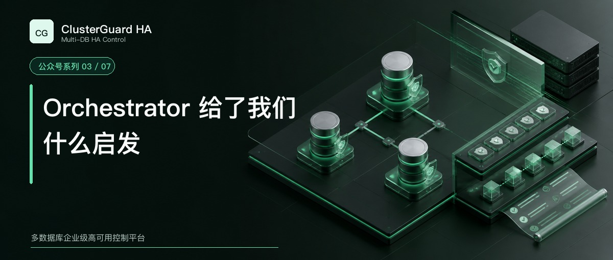

# Orchestrator 给了我们什么启发



MHA 让很多团队第一次把 MySQL 主库故障切换做成了可复用流程。Orchestrator 又向前走了一步，它持续发现复制关系，把拓扑画出来，并依据实例状态分析可以怎样重构或恢复集群。

对 DBA 来说，这种变化很重要。拓扑不再只存在于配置文件和脑海里。每台实例的复制来源、延迟、线程状态和候选关系都可以从一个控制面观察，计划切换和故障恢复也有了统一入口。

ClusterGuard HA 早期原型选择 Orchestrator，原因就在这里。它已经验证了拓扑发现、候选评估和恢复编排的价值。

## Orchestrator 擅长处理什么

Orchestrator 持续探测 MySQL 实例，建立复制拓扑，并提供 Web、API 和命令行入口。它能执行拓扑重构、优雅接管和故障恢复，也会留下恢复审计。

它的候选评估基于实际复制状态。系统会考虑实例可达性、复制位置、数据中心、环境标签和提升规则，再决定某个节点是否适合成为新主。这种状态驱动的恢复方式，比固定写死一台备用主库更能适应真实拓扑。

Orchestrator 自身也有高可用部署方式。官方文档提供共享后端数据库和 Raft 两条路线。服务入口如何通知应用，则通常通过 Hook、DNS、代理、键值存储或其他外部系统完成。

截至本文写作时，原 `openark/orchestrator` 仓库页面显示已于 2025 年 2 月 18 日归档，并指向 Percona 维护分支。这不影响它过去积累的设计价值，也提醒使用者关注后续维护来源和版本路线。

## 原型为什么没有继续做成一个更大的 Fork

在原型阶段，我们围绕 Orchestrator 加入了 Enterprise API、CLI、诊断、修复计划、安全门禁、演练、审计、报告、Webhook、白屏页面、VIP 联动和安装脚本。

这些功能解决了一部分交付问题，也让边界冲突越来越明显。

产品需要不可变的资源身份，Orchestrator 的实例世界长期围绕 `hostname:port` 组织。产品需要让主库角色、VIP 租约、Agent 隔离和 Raft 多数派形成一条原子化操作链。产品还需要统一节点扩容、旧主重建、元数据修正、多数据库 Adapter 和长期版本迁移。

如果继续扩展，新的数据模型、API、配置、CLI、数据库表和执行语义都会同时存在于旧内核旁边。用户很难判断哪个状态才是权威状态，开发也很难证明一条高风险操作没有绕过新的门禁。

因此，项目冻结了 Orchestrator 企业增强原型。原仓库只保留需求、页面和故障测试场景，ClusterGuard HA 在新仓库中重新设计控制内核。

## 保留的是思路，重做的是产品内核

ClusterGuard HA 继续采用几项已经被实践证明有价值的思路。

- 持续发现数据库状态
- 依据当前拓扑评估候选节点
- 将计划切换和故障切换区分开
- 为恢复动作留下审计
- 允许外部系统通过明确接口接入

新的项目没有复制 Orchestrator 源代码，也不兼容它的 API、后端表、配置项、Hook、CLI、包路径和二进制。资源模型、工作流、元数据存储、Adapter SDK、控制面、Agent 和 Web 控制台均为独立实现。

这种 clean-room 方式会增加开发成本。它也消除了一个长期风险，产品不必一边声明独立身份，一边继续依赖旧项目的内部语义。

## 两套系统关注的层次不同

| 关注点 | Orchestrator | ClusterGuard HA 2.1 |
| --- | --- | --- |
| 核心能力 | MySQL 拓扑发现、分析、重构和恢复 | MySQL 高可用控制、端点协调和生产交付 |
| 资源身份 | 主要围绕 `hostname:port` | 不可变 `resource_id` 与 `server_uuid` |
| 控制面高可用 | 共享后端或 Raft | 强制奇数控制节点、Raft 与 mTLS |
| 服务入口 | 通过 Hook 和外部集成更新 | HA Endpoint 纳入统一工作流与验证 |
| 高风险执行 | 恢复规则、命令和审计 | Safety Guard、锁、授权、验证、审计、报告 |
| 数据节点保护 | 依赖恢复逻辑及现场集成 | 受限 Agent、短租约、本地失权隔离 |
| 旧主恢复 | 提供拓扑操作，具体流程依现场 | GTID 评估、增量回挂或全量重建 |
| 节点生命周期 | 以数据库拓扑管理为主 | 安装、同步、修复、任务进度和报告 |
| 多数据库边界 | 面向 MySQL | 通用 Adapter SDK，2.1 正式支持 MySQL |

Orchestrator 的拓扑能力更加成熟，周边生态也积累多年。ClusterGuard HA 目前的优势集中在一体化交付和执行控制。它不应该用一张对比表掩盖自己的版本边界。

## 一个操作为什么必须走统一工作流

ClusterGuard HA 把所有会改变生产状态的动作收进同一条流程。

```text
DISCOVER
PRECHECK
PLAN
SAFETY_GUARD
LOCK
APPROVE
EXECUTE
VERIFY
AUDIT
REPORT
```

发现阶段建立当前事实。预检查判断目标是否属于集群清单，复制和身份条件是否满足。计划固定源节点、目标节点、端点和影响范围。Safety Guard 与操作锁阻止越权和并发修改，平台授权与具体计划绑定。

Adapter 只负责数据库动作。它不能自行跳过锁，也不能因为命令退出码为零就宣布操作成功。执行后必须重新发现并验证数据库角色、复制关系和 HA Endpoint。审计与报告落盘以后，控制台才展示完整结论。

这条流程也用于节点同步和元数据修正。统一语义比为每个按钮各写一套后端逻辑更容易审查。

## 从 Orchestrator 迁移到 ClusterGuard HA

迁移可以分成观察和切权两个阶段。

观察阶段先部署独立的 ClusterGuard HA 控制面，只登记现有数据库，不执行变更。平台依据 `server_uuid` 建立资源身份，补齐集群清单和 VIP 配置。运维人员对比两边发现到的主库、副本、延迟、线程状态和候选排序。

切权阶段需要维护窗口。停用 Orchestrator 自动恢复、VIP Hook、相关 timer、cron、Keepalived 和其他能改变复制关系的程序。现场要验证旧系统已经失去变更权，再由 ClusterGuard HA 接管 VIP 和 Agent，完成一次人工受控切换及旧主回挂。

数据库无需因为控制平台迁移而重装。迁移工作集中在控制权和元数据权威来源。

回退方案也要提前写好。回退时先停止 ClusterGuard HA 的自动恢复与端点变更，确认没有运行中的操作和租约，再恢复旧系统。两个控制器不能同时拥有写权限。


## ClusterGuard HA 还要继续证明什么

独立实现并不会自动带来可靠性。每一种数据库版本、操作系统、网络和存储组合都要重新测试。控制节点多数派、Agent 失联、VIP 唯一性、旧主分叉、binlog 缺口、断电恢复和并发操作都需要现场证据。

2.1.45 的正式交付边界是 MySQL。PostgreSQL 从 2.2 开始开发和验收。Oracle Data Guard Broker 与 SQL Server Always On 仍需独立测试矩阵。未通过认证的 Adapter 能注册和报告能力边界，不能假装已经具备生产执行能力。

下一篇进入 ClusterGuard HA 内部，看看一次按钮操作怎样经过发现、门禁、执行和验证，也看看主库、VIP 与旧主恢复为什么必须放在同一套流程里。

## 资料依据

- [Orchestrator 官方仓库](https://github.com/openark/orchestrator)
- [Orchestrator Topology Recovery](https://github.com/openark/orchestrator/blob/master/docs/topology-recovery.md)
- [Orchestrator High Availability](https://github.com/openark/orchestrator/blob/master/docs/high-availability.md)

[返回系列目录](wechat-series.md)
