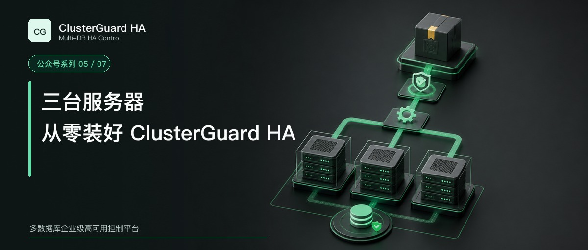

# 三台服务器，从零装好 ClusterGuard HA



这一篇直接完成一次三节点 MySQL 离线部署。

示例使用 ClusterGuard HA `2.1.45`。三台服务器同时承担控制节点、MySQL 数据节点和 Agent，VIP 为 `192.168.102.155`。正式执行前，先把示例地址、网卡和目录替换成现场值。

2.1.45 的生产支持范围是 MySQL。PostgreSQL 从 2.2 系列开始开发和验收，不能拿本文命令直接替换引擎名称后用于生产。

## 先确定三台机器承担什么角色

ClusterGuard HA 控制节点需要三个或更多奇数成员。三节点可以容忍一台控制节点失效，同时保留 Raft 多数派。数据节点数量没有奇数限制。

最简单的部署方式是三台混合节点。

| 节点 | 控制面 | MySQL | Agent |
| --- | --- | --- | --- |
| 192.168.102.152 | 是 | 是 | 是 |
| 192.168.102.153 | 是 | 是 | 是 |
| 192.168.102.154 | 是 | 是 | 是 |

生产环境也可以把控制节点和数据节点分开。安装器通过 `-l` 指定控制节点，通过 `-n` 指定数据节点。无论采用哪种方式，控制节点都要保持奇数并且不少于三个。

目标机器需要能够通过 SSH 管理，主机名保持唯一，时钟能够同步。防火墙至少要允许 SSH、控制台 `3000/TCP`、Raft `10009/TCP` 和 MySQL `3306/TCP` 按规划互通。VIP 必须属于同一二层网络，网卡名称也要提前核对。

## 校验离线交付物

正式交付物和不可变规则见 [ClusterGuard HA 2.1.45 发布说明](release-2.1.45.md)。安装前应从项目正式交付渠道取得压缩包及对应校验文件。

文件名如下。

```text
clusterguard-ha-2.1-45-offline-linux-x86_64.tar.gz
clusterguard-ha-2.1-45-offline-linux-x86_64.tar.gz.sha256
```

先验证外层压缩包，再验证包内文件。

```bash
sha256sum -c clusterguard-ha-2.1-45-offline-linux-x86_64.tar.gz.sha256
tar -xzf clusterguard-ha-2.1-45-offline-linux-x86_64.tar.gz
cd clusterguard-ha-2.1-45-offline-linux-x86_64
sha256sum -c SHA256SUMS
```

包内包含安装脚本、ClusterGuard RPM、离线依赖目录、配置样例和工具。MySQL 官方通用二进制包体积较大，可以单独放在安装目录的 `packages/database/`，也可以放在 `/opt`。安装器会依据 `--engine` 和 `--database-version` 自动选择匹配介质。

例如使用 MySQL 8.0.44 时，可以准备下面的文件。

```text
/opt/mysql-8.0.44-linux-glibc2.17-x86_64.tar.xz
```

目标操作系统缺少 `libncurses.so.5`、`libtinfo.so.5` 等运行库时，要在同发行版、同主版本、同架构的联网镜像机上收集已签名 RPM，再放入 `dependencies/`。安装器会校验依赖，不建议通过关闭 GPG 检查绕过去。

## SSH 密码只输入一次

没有提供 SSH 密钥或密码参数时，真实安装会在开始阶段隐藏提示一次，随后复用到 SSH 和 SCP 操作。

所有节点使用同一密码时可以传 `-P`。多台机器密码不同，可以按节点去重后的顺序传小写 `-p`，也可以使用权限为 `0600` 的 `--ssh-credentials-file`。生产变更更适合凭据文件或 SSH 密钥，避免密码进入 Shell 历史。

主机密钥也不能省略。实验环境可以用 `--accept-host-keys` 首次采集。生产环境应先通过独立渠道核对指纹，再把审核后的文件传给 `--known-hosts`。

## 第一次只看计划

先创建一个受保护的站点目录。状态、证书、密码和后续扩容资料都要长期保存在这里。

```bash
install -d -m 0700 /secure/clusterguard/mysql-ha-3306
```

下面的命令只生成计划，不修改远端服务器。

```bash
./install_clusterguard.sh \
  -l 192.168.102.152,192.168.102.153,192.168.102.154 \
  -n 192.168.102.152,192.168.102.153,192.168.102.154 \
  -u root \
  -ld /var/lib/clusterguard \
  -nd /data \
  --engine mysql \
  --database-version 8.0.44 \
  --database-port 3306 \
  --cluster-name mysql-ha-3306 \
  --vip 192.168.102.155 \
  --interface ens160 \
  --prefix 24 \
  --dependencies dependencies \
  --known-hosts /secure/clusterguard/mysql-ha-3306/known_hosts \
  --state-file /secure/clusterguard/mysql-ha-3306/deployment-state.json \
  --secrets-file /secure/clusterguard/mysql-ha-3306/deployment-secrets.env \
  --work-dir /secure/clusterguard/mysql-ha-3306/site \
  --plan
```

先核对控制节点和数据节点的分工，再对照现场规划检查数据库、目录和 VIP。计划中的版本、端口与网卡必须准确。任何一项不对，都应该先修改参数并重新运行。

安装器默认不会开放远程 root。确实需要时，可以显式增加 `--mysql-root-remote-host '192.168.102.%'`。限定管理网段通常比 `%` 更合适。需要固定 root 密码时，再增加 `--mysql-root-password`，否则由安装器生成受管密码并写入受保护的站点秘密文件。

## 确认后再真实安装

把同一条命令最后的 `--plan` 改成 `--execute`。`--execute` 必须留在完整命令的最后一行，不能等上一条命令结束以后再单独输入。

```bash
./install_clusterguard.sh \
  -l 192.168.102.152,192.168.102.153,192.168.102.154 \
  -n 192.168.102.152,192.168.102.153,192.168.102.154 \
  -u root \
  -ld /var/lib/clusterguard \
  -nd /data \
  --engine mysql \
  --database-version 8.0.44 \
  --database-port 3306 \
  --cluster-name mysql-ha-3306 \
  --vip 192.168.102.155 \
  --interface ens160 \
  --prefix 24 \
  --dependencies dependencies \
  --known-hosts /secure/clusterguard/mysql-ha-3306/known_hosts \
  --state-file /secure/clusterguard/mysql-ha-3306/deployment-state.json \
  --secrets-file /secure/clusterguard/mysql-ha-3306/deployment-secrets.env \
  --work-dir /secure/clusterguard/mysql-ha-3306/site \
  --execute
```

交互执行会要求输入完整集群名称确认。安装器随后检查节点身份和时钟，安装 RPM，生成证书与 Raft 配置，安装或续接 MySQL，建立复制，启动控制面和 Agent，最后等待主库与 VIP 所有权收敛。

MySQL 参数会根据每台机器的物理内存生成。`innodb_buffer_pool_size` 默认取百分之七十并向上取整到 4 GiB 的整数倍，结果不会超过物理内存的百分之八十。`max_connections` 默认是 1000。参数进入生产前仍要结合连接模型、临时表和工作负载复核。

## 首次登录和安装验收

安装完成后，可以访问任一控制节点。

```text
https://192.168.102.152:3000/
```

初始账号是 `admin`，首次密码是 `admin123`。首次登录必须立即改密。改密前，平台只允许认证和修改密码，不能读取或操作集群数据。

每台控制节点检查服务。

```bash
systemctl is-enabled clusterguard-ha.service
systemctl is-active clusterguard-ha.service
systemctl status clusterguard-ha.service --no-pager
```

每台数据节点检查 Agent 和 MySQL。

```bash
systemctl is-enabled clusterguard-agent.service
systemctl is-active clusterguard-agent.service
systemctl is-enabled clusterguard-mysql-3306.service
systemctl is-active clusterguard-mysql-3306.service
ss -lnt | grep ':3306'
mysql -uroot -p -e 'SELECT @@hostname, @@port, @@read_only, @@super_read_only;'
readlink /tmp/mysql.sock
```

控制台应显示三个控制成员、一个 Leader、两个 Follower、一个主库、两个副本和唯一 VIP Owner。

还要在三台数据节点分别检查 VIP。

```bash
ip -o -4 addr show dev ens160 | grep '192.168.102.155/24' || true
```

三台机器合计只能返回一次，并且返回节点必须是当前主库。不要让 Keepalived、Pacemaker 或其他工具同时管理这个 VIP。


## 安装结束后一定保存这些文件

下面的站点资料包含资源 UUID、证书、控制令牌和数据库受管密码。

```text
/secure/clusterguard/mysql-ha-3306/deployment-state.json
/secure/clusterguard/mysql-ha-3306/deployment-secrets.env
/secure/clusterguard/mysql-ha-3306/site/
/secure/clusterguard/mysql-ha-3306/known_hosts
```

它们应保持 `0600` 权限并进入加密备份。后续扩容、修复和重新执行安装器时，要继续使用同一组资料。用空状态覆盖运行中的集群，会破坏资源身份、证书和受管凭据的一致性。

安装成功只代表软件和初始拓扑就绪。下一篇会从控制台开始，完成第一次检查、受控切换、旧主恢复、节点管理和日志复核。

[返回系列目录](wechat-series.md)
