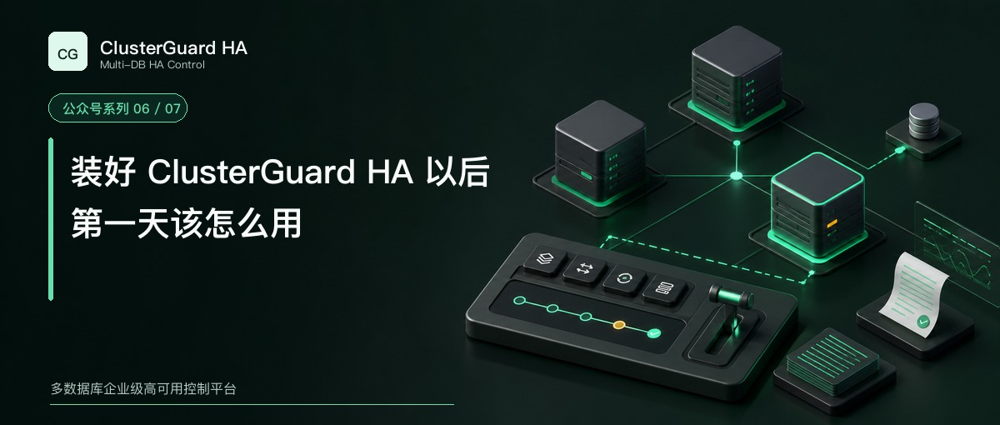

# 装好 ClusterGuard HA 以后，第一天该怎么用



安装完成以后，先别切。

第一天最重要的工作，是确认控制面、数据库拓扑和业务入口看到的是同一套事实，随后完成一次人工受控切换，再把旧主安全恢复到当前主库下面。这套过程跑通以后，才有条件继续做故障测试。

本文以 ClusterGuard HA 2.1.45 和 MySQL 三节点集群为例。

## 第一次登录先改密码

浏览器访问任一控制节点。

```text
https://<控制节点IP>:3000/
```

初始账号是 `admin`。首次密码取自控制节点上与元数据同目录的 root 专属文件 `bootstrap-admin-password`（权限 0600），或取自部署通过 `bootstrap_admin_password_env` 显式配置的口令。登录以后必须立即修改密码，因为首次改密完成以前，平台不会开放集群与拓扑读取，也不会接受审计查询和任何变更操作。

控制台内的切换由已认证会话、CSRF 和角色权限保护。操作员不需要在页面里寻找控制令牌或手工填写一次性审批令牌。外部 API 才使用独立的 Bearer control token，高风险服务调用还要绑定一次性 Approval。

忘记管理员密码时，不要编辑后端 JSON 或密码哈希。应在本地执行受控恢复命令，生成一次性恢复工件，再按运维手册同步到控制节点。

```bash
sudo -u clusterguard /usr/local/bin/clusterguard admin prepare-recovery
```

## 先看控制面是否有变更权

页面显示运行中，还不足以证明可以安全执行操作。Raft 必须只有一个 Leader，voter 数保持奇数，多数派已经确认，各控制节点的 metadata revision 也要最终一致。

在控制节点上可以做三项检查。

```bash
curl --fail --cacert /etc/clusterguard/tls/ca.crt \
  https://127.0.0.1:3000/healthz

curl --fail --cacert /etc/clusterguard/tls/ca.crt \
  https://127.0.0.1:3000/readyz

cgctl --server https://127.0.0.1:3000 \
  --ca-file /etc/clusterguard/tls/ca.crt status
```

Follower 收到写请求后会转发给当前 Leader。Leader 不明确或失去多数派时，写操作应该被阻断。这时要停手，不能绕过平台到数据库上手工提升节点。

## 在左上角选对集群

ClusterGuard HA 可以管理多套 MySQL。左上角的集群下拉框只显示固定集群名称，不把当前主机名拼进名称。选择以后，页面所有拓扑、候选、操作和日志都应切换到同一个 `cluster_id`。

总览适合看总体状态。拓扑页展示当前主库、副本、延迟、主机名、IP、端口、版本、角色和 VIP。节点不可达时应明确显示不可达，角色没有证据时显示未知。


发现某台机器的主机名、IP 或端口变了，不要删除节点再新建。在拓扑页右上角打开“修改元数据”，选择已有资源，输入新 endpoint 和变更原因。预检查确认 MySQL `server_uuid` 与原资源一致以后，平台更新端点并把旧地址保存为 alias，`resource_id` 保持不变。

## 第一次计划切换怎么做

计划切换适用于当前主库健康、复制状态稳定的维护场景。

进入“操作”页面以后，顶部状态条会显示固定集群名称、当前主库、候选主库、VIP 和延迟。候选下拉框只允许选择当前清单内、通过基础评估的副本。

操作顺序如下。

1. 选择目标集群
2. 核对当前主库和 VIP Owner
3. 选择候选主库
4. 点击“解锁操作”
5. 点击“执行切换”
6. 等待预检查、计划、安全门禁、执行和验证全部结束

操作解锁只对当前会话和短时间窗口有效。按钮点击以后，后端还会再次执行 Safety Guard、集群操作锁、平台授权和幂等检查。页面解锁不等于后台门禁失效。


看到“已提交”时还不能离开页面。完整成功至少要满足下面几项。

- 新主库可以写入
- 旧主库只读或已经隔离
- 其他副本跟随新主库
- VIP 只在新主库
- 集群操作锁已经释放
- 审计和报告已经持久化

状态进入 `indeterminate` 或“需复核”时，别重试。系统可能已经改变数据库角色，只是后置验证或回执中断；重复发起只会增加判断难度，应先按操作 UUID 查询当前执行状态。

```bash
cgctl --server https://127.0.0.1:3000 \
  --ca-file /etc/clusterguard/tls/ca.crt \
  operation <操作UUID>
```

## 旧主恢复不需要先猜恢复方式

切换完成以后，原主库可能已经变成离群节点。先启动其数据库服务，并确保 `read_only=ON`、`super_read_only=ON`，也不要手工把 VIP 加回去。

在“操作”页面选择旧主，点击“一键恢复为从库”。平台会主动刷新发现，核对固定资源身份、当前主库、GTID、所需 binlog、清单和 VIP 唯一性。

旧主 GTID 是当前主库的子集，并且追平所需 binlog 仍然存在时，系统选择增量回挂。当前主库已经清理必要 binlog，或者旧主存在 errant GTID 时，系统转入需要审批的全量重建。它不会通过跳事务来伪造一致性。

恢复结束后，要看到复制 IO 和 SQL 线程运行、延迟归零、恢复节点只读、复制源指向当前主库、VIP 仍然唯一。数据库进程启动成功，只能说明服务在线，不能代表节点已经恢复到复制拓扑。

## 添加节点和修复节点走同一入口

“节点”页面负责数据节点、控制节点和混合节点的生命周期任务。

新增节点时，填写固定节点名、平台 UUID、SSH endpoint、数据库版本和端口，再选择经过批准的软件包和数据同步方式。系统会依次执行磁盘与端口检查、安装、数据同步、复制配置、验证和元数据提交。

物理损坏节点修复后也从这个入口进入。继续使用原有平台 UUID，数据库原生身份因重建改变时，再走 replacement 和 reconcile。这样任务记录能把旧资源和替换后的实例关联起来。


任一阶段失败都会停止后续提交。任务详情保留当前阶段、同步方式、操作对象、脱敏日志和报告。不要在任务失败以后直接到后端数据库里补一条节点记录。

## 操作日志要每天能看懂

“操作日志”是独立菜单。每条记录先展示时间和固定集群名称，同时标明源节点、目标节点与最终状态。发起者和风险判断也要明确，两个 UUID 用来继续追查操作与报告。

原始返回默认折叠，排障时再展开。即使后来修改了主机名或端口，历史记录也应通过资源 UUID 还原当时的节点关系。


一次切换在页面上显示成功，却没有原主库、目标主库、验证和报告，这条记录就不完整。日志价值来自证据链，不来自记录数量。

## 什么时候可以开启自动故障切换

新安装完成后，先保持人工受控模式。至少完成多轮计划切换、旧主增量回挂、全量重建、VIP 唯一性、控制节点 Leader 变化和整机重启测试。

自动故障切换无需人工输入令牌，但仍然要通过数据库探测、Raft 多数派、Safety Guard、操作锁、Agent 本地隔离、验证和审计。控制面失去多数派或旧主隔离证据不足时，系统应该停止提升。

开启自动恢复前，必须在测试环境或批准的维护窗口完成故障矩阵。下一篇就用这份矩阵回答一个更重要的问题，软件已经装好，怎样证明它适合当前生产站点。

[返回系列目录](wechat-series.md)
