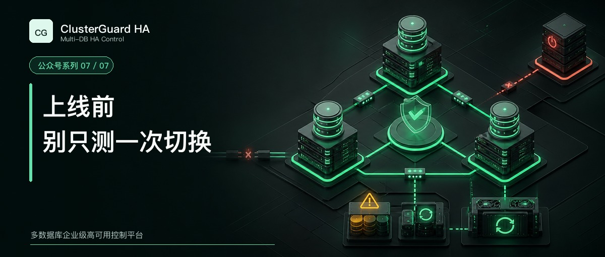

# 上线前别只测一次切换



高可用产品最容易给人信心的时刻，是第一次切换成功。

这份信心也最容易来得太早。计划切换只能证明健康主库和健康副本之间的一条路径。生产故障可能是数据库进程崩溃、整机断电、存储卡顿、管理网络中断、数据网络分区，也可能发生在上一次操作还没有结束的时候。

ClusterGuard HA 2.1.45 通过构建和项目测试，只能证明这份版本达到对应交付基线。现场的 MySQL 小版本、操作系统、网络、存储、VIP 网卡和隔离方式改变以后，仍然要重新验收。

## 先写清楚通过标准

每个测试都要记录故障注入时间、首次稳定发现时间、候选确定时间、新主可写时间、VIP 可用时间、复制恢复时间和最终报告时间。

RTO 不应只统计 `PROMOTE` 命令用了多久。业务可用性要从旧入口停止接受错误写入，一直计算到新入口恢复服务。RPO 也不能只看复制延迟显示为零，要结合 GTID、事务校验和业务抽样证明数据边界。

默认故障探测每秒执行一次，连续 3 次失败且时间跨度不少于 3 秒构成稳定故障证据。Agent 另有 15 秒授权失效隔离宽限，后续还要经过多数派、租约、执行和验证。任何单项配置都不能被宣传为固定总切换时间，端到端时间必须从应用写入口在现场测量。

每个场景都应满足共同底线。

- 任一时刻最多只有一个可写主库
- 任一时刻最多只有一个 VIP Owner
- 候选节点来自当前集群权威清单
- 失去 Raft 多数派时不执行高风险变更
- 相同操作不会因重复点击执行两次
- 结果不确定时保留操作状态，不伪报成功
- 审计和报告能够还原源节点、目标节点和验证结论

## 第一组测试覆盖健康状态下的切换

先让三台数据库都健康，复制延迟稳定在可接受范围。依次选择每一个副本作为候选，完成主库和 VIP 同步切换。切换完成后，把旧主恢复为从库，再进行下一轮。

三节点至少要覆盖下面的轮转。

```text
01 -> 02 -> 03 -> 01
01 -> 03 -> 02 -> 01
```

每次都检查新主可写、两个副本只读并跟随、VIP 只有一个 Owner、操作锁释放、操作日志记录正确。连续操作之间要等上一条工作流进入最终状态，随后再验证并发点击确实会被幂等键或操作锁阻断。

这组测试还能发现候选列表串集群、固定集群名称显示错误、历史拓扑未失效和旧主没有重新挂回等产品问题。

## 第二组测试区分进程故障和整机故障

数据库进程停止时，控制节点和 Agent 可能仍然在线。整机断电时，数据库、Agent 和主机网络会同时消失。两种场景不能只看一个端口失败就用同样结论处理。

进程故障测试要停止当前主库 MySQL 服务，记录探测窗口、候选选择、Agent 隔离和 VIP 转移。整机故障测试则关闭当前主库，确认剩余控制节点仍有多数派，随后观察新主和 VIP 收敛。

原主机恢复供电以后，数据库必须保持只读，VIP 不能自行回到旧主。节点进入待恢复状态，由旧主恢复工作流重新加入当前复制关系。

如果控制节点和数据节点混合部署，还要轮流关闭当前 Leader 所在机器和普通 Follower 所在机器。系统应先完成 Raft Leader 转移，再决定数据库恢复动作，不能把控制面 Leader 与数据库主库混为一个概念。

## 第三组测试专门制造网络分区

网络分区比关机更危险。旧主可能仍然运行并接受本地连接，只是多数控制节点已经看不到它。

至少要测试数据网络中断、管理网络中断和单节点与其余节点隔离。观察 Agent 是否在失去多数授权后撤销 VIP 并保持数据库只读，剩余控制面是否在确认多数和隔离窗口后才提升候选。

还要测试控制节点只剩一个时的行为。此时数据库可能都能访问，平台也必须拒绝新的高风险操作。可用性不能以放弃唯一写入约束为代价。

现场具备 BMC、PDU、云 API 或虚拟化平台时，应增加外部 fencing 验收。Agent 本地保护覆盖不了操作系统完全失控、管理网与数据网同时中断等所有故障，第二层隔离可以收紧这类边界。

## 第四组测试验证 VIP 唯一性

每轮切换前后，都在全部数据节点检查目标地址。

```bash
ip -o -4 addr show dev ens160 | grep '192.168.102.155/24' || true
```

所有输出合计只能有一条，而且必须来自当前主库。

测试环境还可以在副本上临时制造重复 VIP，随后运行平台检查。预期结果是唯一性验证失败，高风险切换被阻断，告警列出多个 Owner。清理测试地址以后再验证恢复。

生产环境不能让 Keepalived、Pacemaker、人工脚本和 ClusterGuard HA 同时管理同一个 VIP。多控制器争夺入口时，任何一方单独测试成功都没有意义。

## 第五组测试旧主的三种恢复路径

第一条路径是正常增量回挂。旧主 GTID 是当前主库的子集，必要 binlog 仍然存在。平台应重新配置复制并追平数据。

第二条路径是 binlog 缺口。在测试环境清理旧主追赶所需的日志，再发起恢复。平台应拒绝猜测性增量修复，转入全量重建，从当前主库重新同步数据。

第三条路径是数据分叉。让旧主产生当前主库没有的测试 GTID，再尝试恢复。平台应识别 errant GTID，阻断直接回挂，并要求全量重建或人工数据处置。

三条路径最后都要检查固定资源身份。全量重建可以改变数据库原生身份时，必须走 replacement 和 metadata reconcile，不能悄悄创建重复节点。

## 第六组测试控制面本身

依次重启一个 Follower、另一个 Follower，再重启 Leader。每次等待 quorum、Leader 和 metadata revision 收敛以后再进行下一步。

随后测试 Leader 在操作提交前失效、执行中失效和验证阶段失效。新 Leader 应根据持久操作状态继续判断，不能把已经执行过的数据库动作当作从未发生。状态无法确定时应标记 `indeterminate`，让运维人员按操作 UUID 复核。

还要检查证书、Raft 日志和快照恢复。节点重新加入后，资源清单、VIP 租约、操作状态和审计数量应与多数派一致。

## 第七组测试重启、存储和并发边界

计划维护需要覆盖只停数据库服务和整机下电两种方式。页面的一键关机应先冻结自动恢复、设置维护状态、持久化只读，再按策略停止服务或主机。机器重新启动以后，systemd 恢复单元要等待控制面和主库健康，再解除保护。

存储测试至少覆盖磁盘空间不足、元数据目录只读、数据库 IO 变慢和日志写入失败。审计或报告无法持久化时，高风险操作不能把证据丢失当作普通告警。

并发测试要同时发起两次切换、切换与旧主恢复、切换与元数据修正。相同集群只能有一个持有者获得操作锁。另一个请求应收到明确阻断，不应静默排队到环境已经改变以后继续执行。

## 最后检查运维能不能接住故障

技术测试通过以后，还要让值班人员独立完成一次操作。

他们需要知道怎样查看 Leader 和 quorum，怎样判断操作已经成功，看到 `indeterminate` 时为什么不能重复点击，旧主什么时候可以增量回挂，什么时候必须全量重建，双 VIP 又该怎样定位。

监控系统要覆盖控制服务、Leader、多数派、metadata revision、数据库角色、复制延迟、线程状态、VIP Owner、Agent reconcile 和异常操作。Prometheus 可以读取平台文本接口，Zabbix 可以通过只读 JSON API 获取同一批健康数据。

操作日志和报告还要进入备份与留存制度。站点状态、证书和受管秘密应加密备份，恢复过程也要定期演练。

## 怎样给出上线结论

生产准入报告应该写清版本、服务器、数据库、网络、存储、VIP、隔离方式、每个场景的结果、实测 RTO、实测 RPO 和遗留风险。

某一轮切换成功，可以作为证据之一。故障矩阵完成、异常行为符合 fail-closed 预期，并且运维人员能够处理不确定状态以后，ClusterGuard HA 才进入当前站点的可交付范围。

高可用平台无法让硬件永远不坏。它能做的是把故障发生后的判断权、执行权和证据链管住，让系统在知道事实时前进，在证据不足时停下来。

[返回系列目录](wechat-series.md)
