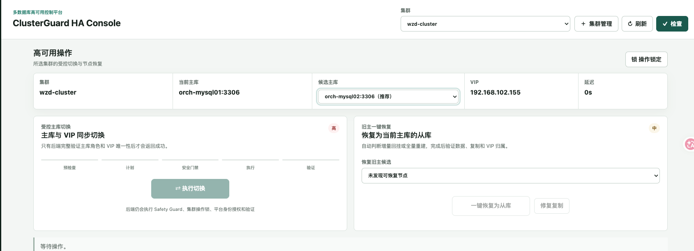
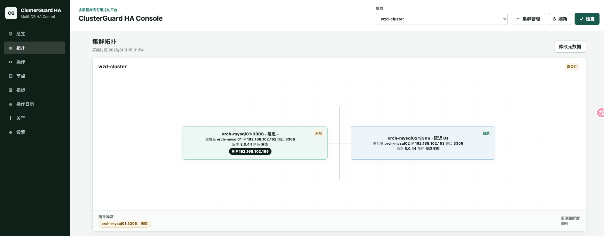
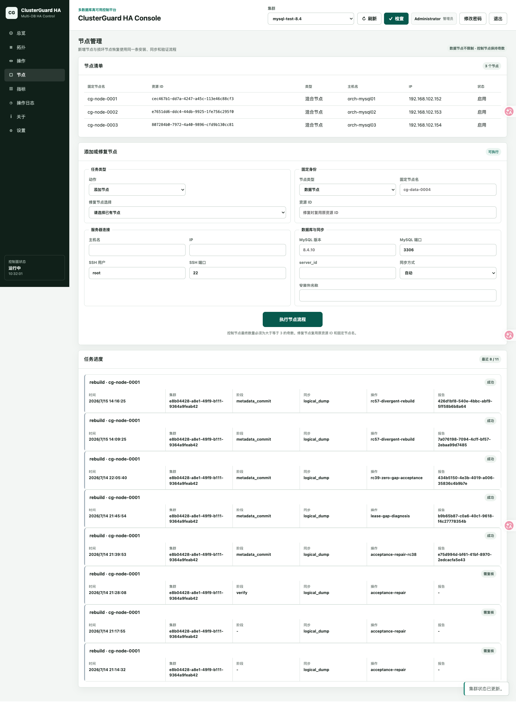
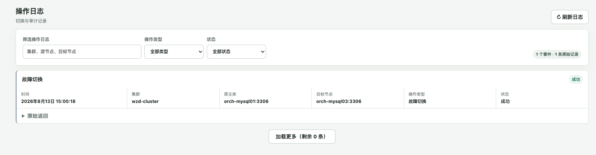

# ClusterGuard HA 是怎样管住数据库切换这件事的

本文是 ClusterGuard HA 公众号系列第四篇。前三篇介绍了产品来路，也分别讨论了 MHA 和 Orchestrator。接下来进入控制内核，看看一次切换怎样从按钮走到可复核的最终状态。

数据库高可用最麻烦的时刻，往往从主库不可达之后才开始。

监控先报了一条连接失败。值班人员接着要判断故障是不是稳定存在，哪台从库的数据最完整，旧主有没有继续提供写服务。新主完成提升以后，复制关系要重建，业务入口也要跟过去。过一会儿旧主恢复了，它还能不能直接作为从库加回来，又成了下一道题。

这些动作分散在数据库命令、VIP 脚本、定时任务和人工判断里时，一次切换很容易留下半完成状态。数据库已经换了角色，VIP 还在旧节点。页面写着成功，后台验证没有跑完。旧主重新上线后仍然可写，两个节点各自认为自己是主库。每一件事单看都能处理，连起来就很难让人放心。

ClusterGuard HA 就是从这个完整过程出发做的一套高可用控制平台。它把数据库发现、候选评估、主库切换、VIP 所有权、旧主恢复、安全门禁和审计记录放进同一个控制系统，让每一步都有前置条件，也有可以复核的结果。

## 一个按钮背后要做完多少事

运维人员在控制台里看到的是当前主库、候选主库、VIP 和复制延迟。点击执行切换以后，后台会按固定顺序推进。

```text
DISCOVER
PRECHECK
PLAN
SAFETY_GUARD
LOCK
APPROVE
EXECUTE
VERIFY
AUDIT
REPORT
```

系统先读取最新拓扑，核对候选节点是否属于当前集群，再检查复制线程、GTID、延迟和版本兼容性。计划生成以后，ClusterGuard HA 会取得集群级操作锁，避免两个切换同时落到同一套数据库上。高风险操作经过授权后才能进入执行阶段。

数据库角色发生变化以后，流程还没有结束。控制器会重新发现拓扑，确认只有一个节点可写，副本正在跟随新主，VIP 也只有一个所有者。验证、审计和报告都写入持久状态以后，页面才会给出最终结果。执行已经改变数据库、后置验证却没有完成时，系统会标记为需要复核，不会只看命令退出码就宣布成功。



这套设计看起来比一条提升主库的命令啰嗦。生产事故里最费时间的，常常是那些命令没有回答的问题。ClusterGuard HA 把这些问题提前写进流程，让值班人员少靠记忆和临场猜测。

## 主库和 VIP 必须一起移动

很多 MySQL 主从方案能完成数据库角色切换，却把业务入口留给另一套脚本处理。两套逻辑各自成功一次，不代表最终状态一定正确。

ClusterGuard HA 把主库角色和 HA Endpoint 放在同一份操作计划里。切换前，它确认当前 VIP 所有者和主库一致。切换时，它先处理源节点隔离，再提升候选节点并调整复制关系。切换后，它验证新主可写、旧主保持只读，随后确认 VIP 已经落到新主，并且其他节点没有残留同一个地址。

VIP 所有权通过短期租约协调。租约写入 Raft 多数派，只有当前 Leader 能提交有效变更。数据节点上的受限 Agent 也会检查自己能否继续获得多数授权。节点失去授权后会撤销旧 VIP，并保持数据库只读。控制节点重启以后，持久租约和拓扑状态还能继续参与收敛。

这一层很重要。网络分区时，旧主可能仍在运行，只是控制面和另一半节点看不到它。单纯检测 3306 不通，无法证明旧主已经停止写入。ClusterGuard HA 会把多数派、操作锁、源节点隔离和 Agent 本地保护一起纳入判断。现场具备 BMC、PDU、云 API 或虚拟化平台时，还可以增加外部隔离，进一步收紧故障边界。

## 节点身份不能跟着主机名漂

传统管理工具常把 `hostname:port` 当作节点身份。主机名一改，旧记录和新记录就可能同时出现。端口调整以后，同一台数据库又像多出一个节点。集群一多，串节点和重复节点很难排查。

ClusterGuard HA 给每个持久资源分配不可变的 `resource_id`，物理节点还有全局唯一的固定节点名。MySQL 实例通过原生 `server_uuid` 识别。主机名、IP 和端口只属于可修改端点。发现到同一个 `server_uuid` 出现在新地址时，平台更新端点并保留旧地址作为别名，原来的资源身份不会变化。

集群还有一份权威清单。发现任务只能探测清单内登记的地址，不能在请求中临时塞入另一套集群的节点。清单发生变化后，代次会推进，旧拓扑随即失效，下一轮完整发现通过以后才重新建立可信状态。



拓扑页面因此只展示当前探测能证明的事实。数据库没有启动，就显示不可达。角色无法确认，就显示未知。旧数据不会被拿来填一个看起来正常的节点卡片。

## 故障切完以后，旧主还得回来

主库故障并不以新主上线为终点。旧主恢复后，它的事务历史可能和新主一致，也可能已经产生分叉。直接修改复制源有时能恢复复制，有时会把更难处理的问题留到下一次故障。

ClusterGuard HA 会先做旧主恢复检查。GTID 历史兼容、缺失事务能够安全追平时，可以走增量回挂。发现数据分叉、日志缺失或增量条件不满足时，平台转入全量重建流程。节点安装、数据同步、复制恢复和完成验证都作为生命周期任务执行，并留下阶段、时间、操作对象和报告。



新增节点也走同一套任务系统。控制节点必须保持不少于三个的奇数成员，数据节点数量不受这个约束。数据库和控制器可以部署在同一批服务器，也可以分开部署。离线安装包会生成固定节点身份、证书、Raft 配置、Agent、数据库配置和 systemd 服务，安装前先输出只读计划，确认后才开始执行远程变更。

## 运维看到的应该是证据

高可用平台不能只给一个绿色状态。值班人员需要知道什么时候切过主库，原主是谁，目标节点是谁，安全检查经过了哪些步骤，最后验证到了什么程度。

ClusterGuard HA 的操作日志先展示时间、集群、原主库、目标节点和最终状态。排障时可以继续展开原始返回、操作 UUID、工作流阶段、检查项和报告。平台还提供 JSON 健康接口和 Prometheus 文本输出，现有监控系统可以直接采集，不要求额外部署一套监控运行时。



控制台本身带有角色权限、首次改密、会话和 CSRF 保护。管理员可以管理平台和用户，操作员执行受控数据库动作，只读用户查看状态。浏览器不会拿到审批密钥，平台内部签发的高风险授权和具体操作计划绑定，并且只能使用一次。

## 从 Orchestrator 迁移也有明确边界

ClusterGuard HA 借鉴了拓扑发现、候选评估和恢复编排这些经过验证的思路，产品内核采用独立实现。它不会导入 Orchestrator 后端表，也不复用旧 API、配置、Hook 或二进制。

已有 MySQL 集群接入时不需要重装数据库。推荐做法是先独立部署三节点控制面，登记现有实例，依据 `server_uuid` 重新建立身份关系。两个系统可以在观察期同时做只读发现，运维人员对比主库、副本、复制状态、候选排序和 VIP Owner。

正式切权要安排维护窗口。旧 Orchestrator 的恢复能力、VIP Hook、timer、cron 和 Keepalived 都要停止，现场还要证明它已经不能再提升主库或修改复制源。ClusterGuard HA 随后接管现有 VIP 和 Agent，完成第一次人工受控切换。现场测试覆盖故障切换、旧主恢复和网络分区以后，再决定是否开启自动故障切换。

同一套数据库在任何时刻只能有一个系统掌握恢复和 VIP 变更权。这条规则比迁移速度更重要。

## 当前版本能交付什么

`2.1.45` 是 ClusterGuard HA 2.1 系列的封板版本，正式支持范围是 MySQL 高可用。它包含 MySQL 拓扑发现、健康诊断、候选评估、受控切换、自动故障切换、VIP 协调、旧主恢复、节点生命周期、审计报告、中文控制台、API、`cgctl`、systemd 和离线部署包。

PostgreSQL 从 2.2 系列开始开发和验收。Oracle Data Guard Broker 与 SQL Server Always On 已经预留独立适配器和能力门，仍需分别完成测试矩阵与现场认证，不能用 2.1 的 MySQL 验收结果代替。

软件版本通过，只说明这份构建完成了对应测试。数据库小版本、操作系统、存储、网络、VIP 网卡和隔离方式发生变化以后，生产站点仍然要重新做切换、断电、网络分区、旧主恢复和并发操作测试。

ClusterGuard HA 想解决的事情很具体。数据库发生故障时，系统要知道自己看到了什么，也要知道哪些事实还没有证实。一次变更要有唯一执行者，主库和业务入口要保持一致，故障节点恢复以后还要安全回到复制关系里。每一步都要能从日志和报告里查回来。

[返回系列目录](wechat-series.md)
