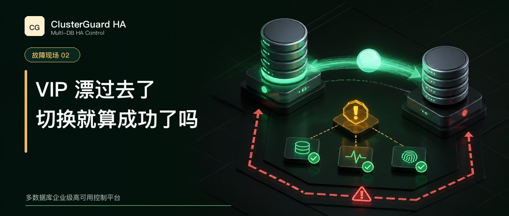

# VIP 漂过去了，切换就算成功了吗

一次 MySQL 切换结束以后，新主库已经可以写，VIP 也出现在新节点上。

看起来一切正常。

还没完。

如果旧节点上的 VIP 没有成功删除，网络恢复以后，两个节点可能同时宣告同一个业务地址，客户端最终连到哪台机器，会受到交换机、ARP 缓存和当时网络路径的影响；数据库主从关系即使完全正确，业务入口仍然可能把写请求送到错误节点。

`ip addr add` 成功只能证明新节点加上了地址，不能证明高可用切换完成。

## 数据库角色和业务入口要一起验证

MySQL 主库切换和 VIP 漂移经常由两套脚本完成。

第一套脚本提升从库，第二套脚本删除旧地址并添加新地址。它们各自都有成功返回，也可能在不同时间失败。数据库已经换主、VIP 还在旧主，或者 VIP 已经移动、候选却没有提升，都会留下半完成状态。

ClusterGuard HA 把主库角色和 HA Endpoint 放进同一个操作计划。切换前先确认当前主库、候选节点和 VIP Owner。执行后重新发现拓扑，并验证下面这些事实。

- 新主库唯一可写
- 旧主库只读或已经隔离
- 副本跟随新主库
- VIP 只有一个 Owner
- VIP Owner 与当前主库一致

有一项无法证明，操作就不能只凭脚本退出码宣布完整成功。

## 旧主失联时谁来删除 VIP

最难处理的情况，是旧主所在网络已经断开。控制器无法远程执行删除地址，旧主又可能仍在运行。

ClusterGuard HA 使用短期 VIP 所有权租约。租约由当前 Leader 写入 Raft 多数派，数据节点上的受限 Agent 周期性确认自己仍然得到授权。节点失去多数授权后，应撤销本机 VIP，并让数据库保持只读。

这套机制把一部分隔离判断放回节点本地。旧主和多数控制节点断开时，即使控制器无法 SSH 到它，Agent 仍能根据授权到期执行 fail-closed 保护。

Agent 也有失效边界。操作系统完全卡死、管理网和数据网同时异常，或者本地定时器无法运行时，还需要 BMC、PDU、云 API 或虚拟化平台提供第二层外部 fencing。高可用设计要把这些边界写进验收，不能用一个“自动漂移”按钮遮住它们。

## 切换时间要从业务入口计算

有些测试只记录提升主库命令的耗时。业务感受到的中断，还包括故障确认、源节点隔离、候选评估、VIP 收敛和连接重建。

ClusterGuard HA 默认以五秒间隔探测，连续六次失败形成三十秒证据窗口，随后还要经过多数派与隔离检查。三十秒代表探测条件，不代表端到端 RTO 固定为三十秒。现场需要从旧入口失效开始，一直测到新入口恢复可用。

一次可靠切换要回答两个问题。谁是唯一可写主库，谁是唯一业务入口。

两个答案指向同一节点，并且都有后端验证证据，这次切换才算走完。

完整机制可以继续阅读 [ClusterGuard HA 是怎样管住数据库切换这件事的](wechat-clusterguard-ha-introduction.md)。

[查看短篇目录](wechat-hooks.md)
